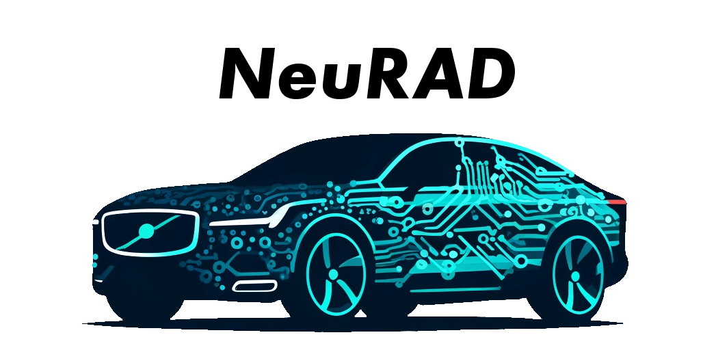
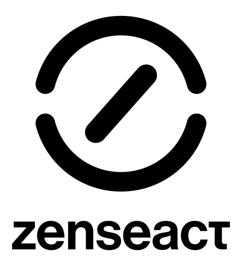
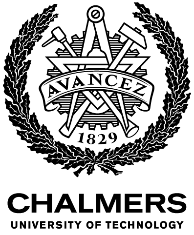
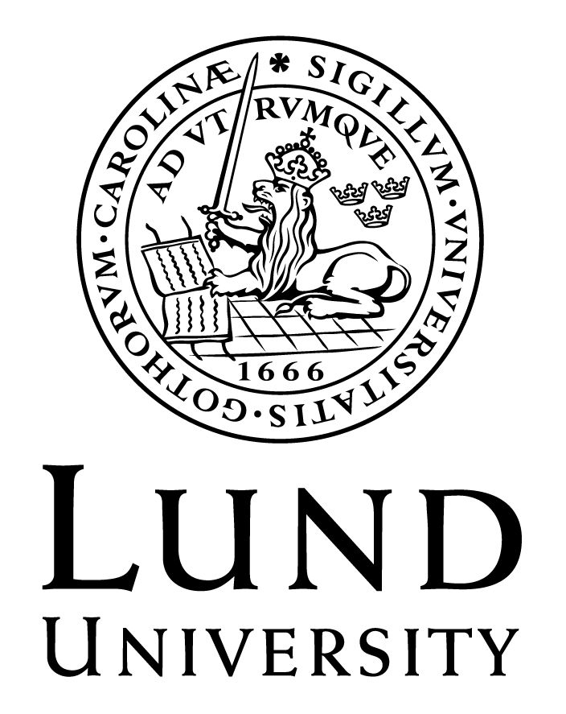
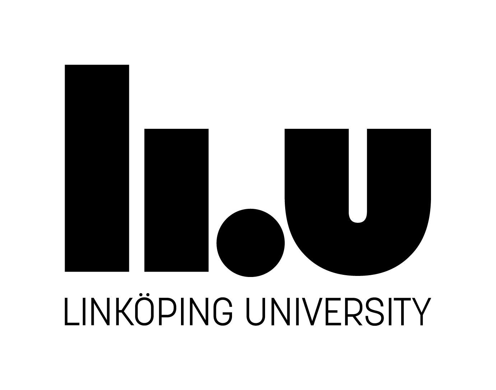
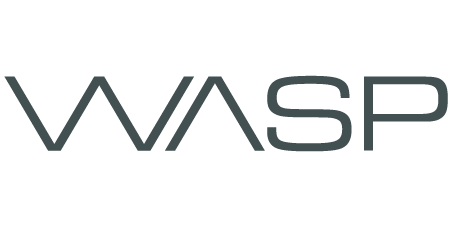
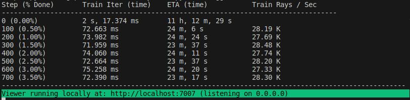

<p align="center">
    <!-- project badges -->
    <a href="https://research.zenseact.com/publications/neurad/"></a>
    <a href="https://research.zenseact.com/publications/splatad/"></a>
    <!-- paper badges -->
    <a href="https://arxiv.org/abs/2311.15260">
        
    </a>
    <a href="https://arxiv.org/abs/2411.16816">
        
    </a>
</p>


<div align="center">
<picture>
    <source media="(prefers-color-scheme: dark)" srcset="docs/_static/imgs/neurad_logo_with_text_dark.png" />
    
</picture>
</div>

<div align="center">
<h3 style="font-size:2.0em;">Neural Rendering for Autonomous Driving</h3>
<h4>CVPR 2024 highlight + CVPR 2025</h4>
</div>
<div align="center">

[Quickstart](#quickstart) ·
[Learn more](#learn-more) ·
[Planned Features](#planned-featurestodos) ·
[Project page](https://research.zenseact.com/publications/neurad/)

</div>

# About

This is the official code release of the CVPR 2024 [paper](https://arxiv.org/abs/2311.15260) _NeuRAD: Neural Rendering for Autonomous Driving_ and CVPR 2025 [paper](https://arxiv.org/abs/2411.16816) _SplatAD: Real-Time Lidar and Camera Rendering with 3D Gaussian Splatting for Autonomous Driving_ building on top of [Nerfstudio](https://github.com/nerfstudio-project/nerfstudio). Besides releasing the code for NeuRAD and SplatAD, we hope that this can lay the ground-work for research on applying neural rendering methods in autonomous driving.

In line with Nerfstudio's mission, this is a contributor-friendly repo with the goal of building a community where users can more easily build upon each other's contributions.

Do you have feature requests or want to add **your** new AD-NeRF model? Or maybe provide structures for a new dataset? **We welcome contributions!**

<div align="center">
<a href="https://zenseact.com/">
<picture style="padding-left: 10px; padding-right: 10px;">
    <source media="(prefers-color-scheme: dark)" srcset="docs/_static/imgs/ZEN_Vertical_logo_white.svg" />
    
</picture>
</a>
<a href="https://www.chalmers.se/en/">
<picture style="padding-left: 10px; padding-right: 10px; padding-bottom: 10px;">
    <source media="(prefers-color-scheme: dark)" srcset="docs/_static/imgs/EN_Avancez_CH_white.png" />
    
</picture>
</a>
<a href="https://www.lunduniversity.lu.se/">
<picture style="padding-left: 10px; padding-right: 10px;">
    <source media="(prefers-color-scheme: dark)" srcset="docs/_static/imgs/LundUniversity_C2line_NEG.png" />
    
</picture>
</a>
<a href="https://liu.se/en">
<picture style="padding-left: 10px; padding-right: 10px;">
    <source media="(prefers-color-scheme: dark)" srcset="docs/_static/imgs/LiU_secondary_1_white-PNG.png" />
    
</picture>
</a>
<a href="https://wasp-sweden.org/">
<picture>
    <source media="(prefers-color-scheme: dark)" srcset="docs/_static/imgs/WASP-logotype-white.png" />
    
</picture>
</a>
</div>

# News
[June 2025] Code for [SplatAD](research.zenseact.com/publications/splatad/) is now released in neurad-studio. The code uses our custom fork of gsplat, found [here](https://github.com/carlinds/splatad), for handling rolling shutter and lidar rendering. For Apptainer users we provide [a recipe](apptainer_recipe) that lets you build an image with all the needed dependencies.


# Quickstart

The quickstart will help you get started with the NeuRAD model on a PandaSet sequence.
For more complex changes (e.g., running with your own data/setting up a new NeRF graph), please refer to our [references](#learn-more).

## 1. Installation: Setup the environment

### Prerequisites

Our installation steps largely follow Nerfstudio, with some added dataset-specific dependencies. You must have an NVIDIA video card with CUDA installed on the system. This library has been tested with version 11.8 of CUDA. You can find more information about installing CUDA [here](https://docs.nvidia.com/cuda/cuda-quick-start-guide/index.html).

### Create environment

The models require `python >= 3.10`. We recommend using conda to manage dependencies. Make sure to install [Conda](https://docs.conda.io/miniconda.html) before proceeding.

```bash
conda create --name neurad -y python=3.10
conda activate neurad
pip install --upgrade pip
```

### Dependencies

Install PyTorch with CUDA (this repo has been tested with CUDA 11.7 and CUDA 11.8) and [tiny-cuda-nn](https://github.com/NVlabs/tiny-cuda-nn).
`cuda-toolkit` is required for building `tiny-cuda-nn`.

For CUDA 11.8:

```bash
pip install torch==2.0.1+cu118 torchvision==0.15.2+cu118 --extra-index-url https://download.pytorch.org/whl/cu118

conda install -c "nvidia/label/cuda-11.8.0" cuda-toolkit

# Some need to upgrade dill prior to tiny-cuda-nn install
pip install dill --upgrade
pip install --upgrade pip "setuptools<70.0"

pip install ninja git+https://github.com/NVlabs/tiny-cuda-nn/#subdirectory=bindings/torch
```

For support of Waymo-Open-Dataset v2 (requires python3.10, also dependencies from this package are very strict so cannot add it to pyproject.toml and need install first):
```bash
pip install waymo-open-dataset-tf-2-11-0==1.6.1
```

We refer to [Nerfstudio](https://github.com/nerfstudio-project/nerfstudio/blob/v1.0.3/docs/quickstart/installation.md) for more installation support.

### Installing neurad-studio
```bash
git clone https://github.com/georghess/neurad-studio.git
cd neurad-studio
pip install -e .
```

### Installing kernels for SplatAD
If you want to use [SplatAD](nerfstudio/models/splatad.py), our 3DGS-based method for camera and lidar rendering (paper [here](research.zenseact.com/publications/splatad/)), you will need to also install [our custom fork of gsplat](git@github.com:carlinds/splatad.git).


**OR** if you want to skip all installation steps and directly start using NeuRAD, use the provided docker image or apptainer recipe:

[Dockerfile](Dockerfile) or [Apptainer recipe](apptainer_recipe).

## 2. Training your first model!

The following will train a _NeuRAD_ model. However, training _SplatAD_ instead is as easy as calling a different method name.

### Data preparation

Begin by downloading [PandaSet](https://huggingface.co/datasets/georghess/pandaset) and unzip it under ```data/pandaset```.
The dataset is no longer hosted by Scale but can be downloaded from the provided huggingface link.

### Training

Training models is done the same way as in nerfstudio, i.e.,

```bash
# Train NeuRAD
python nerfstudio/scripts/train.py neurad pandaset-data
```

If everything works, you should see training progress like the following:

<p align="center">
    
</p>

Navigating to the link at the end of the terminal will load the webviewer. If you are running on a remote machine, you will need to port forward the websocket port (defaults to 7007).

<p align="center">
    
</p>

To train SplatAD instead, you simply call
```bash
# Train SplatAD
python nerfstudio/scripts/train.py splatad pandaset-data
```

### Troubleshooting

If you run into issues, it could be due to the training taking up too much memory. You can try to adjust the model parameters according to the neurad-tiny [vscode launch config](https://github.com/georghess/neurad-studio/blob/master/.vscode/launch.json#L51).

### Resume from checkpoint / visualize existing run

It is possible to load a pretrained model by running

```bash
pyhton nerfstudio/scripts/train.py neurad pandaset-data --load-dir {outputs/.../nerfstudio_models}
```

## Visualize existing run

Given a pretrained model checkpoint, you can start the viewer by running

```bash
python nerfstudio/scripts/viewer/run_viewer.py --load-config {outputs/.../config.yml}
```

## 3. Exporting Results

Once you have a NeRF model you can render its output. There are multiple different renders, more info available using

```bash
python nerfstudio/scripts/render.py --help
```


## 4. Advanced Options

### Available models

We currently provide implementations for the following models:
- ```splatad```: 3DGS-based. Official implementation for [SplatAD](https://research.zenseact.com/publications/splatad/). This is currently our fastest and best performing model on AD scenes.
- ```neurad```: NeRF-based. Official implementation for [NeuRAD](https://research.zenseact.com/publications/neurad/).
- ```unisim```: NeRF-based. This is an unofficial of [UniSim](https://openaccess.thecvf.com/content/CVPR2023/papers/Yang_UniSim_A_Neural_Closed-Loop_Sensor_Simulator_CVPR_2023_paper.pdf). Available as plugin, see [https://github.com/carlinds/unisim](https://github.com/carlinds/unisim) for more info.
Beside NeuRAD, we also provide our 3DGS-based model SplatAD.

Any of these models can be trained as described above
```bash
# Train model
python nerfstudio/scripts/train.py <model name> pandaset-data
```

Further, as we build on top of nerfstudio, models such as ```nerfacto``` or ```splatfacto``` are available as well, see nerfstudio for details. However, note that these are made for static scenes.

For a full list of included models run `python nerfstudio/scripts/train.py --help`.

### Modify Configuration

Each model contains many parameters that can be changed, too many to list here. Use the `--help` command to see the full list of configuration options.

```bash
python nerfstudio/scripts/train.py neurad --help
```

### Tensorboard / WandB / Comet / Viewer

There are four different methods to track training progress, using the viewer, [tensorboard](https://www.tensorflow.org/tensorboard), [Weights and Biases](https://wandb.ai/site), and [Comet](https://comet.com/?utm_source=nerf&utm_medium=referral&utm_content=github). You can specify which visualizer to use by appending `--vis {viewer, tensorboard, wandb, comet viewer+wandb, viewer+tensorboard, viewer+comet}` to the training command. Simultaneously utilizing the viewer alongside wandb or tensorboard may cause stuttering issues during evaluation steps.

# Learn More

And that's it for getting started with the basics of NeuRAD. If you are missing some features, have a look at [Planned Features](#planned-featurestodos) to see if we have plans on implementing this. Otherwise, feel free to open an issue, or even better implement it yourself and open a PR!

If you want to add a dataset, look [here](#adding-datasets). If you want to add a method, have a look [here](#adding-methods).

## Adding Datasets

We have provided dataparsers for multiple autonomous driving dataset, see below for a complete list. However, your favorite AD dataset might still be missing.

To add a dataset, create `nerfstudio/data/dataparsers/mydataset.py` containing one dataparsers config class `MyADDataParserConfig` and one dataparser class `MyADData`. Preferrably, these inherit from `ADDataParserConfig` and `ADDataParser`, as these provide common functionality and streamline the expected format of AD data. For most datasets, it should then be sufficient to overwrite `_get_cameras`, `_get_lidars`, `_read_lidars`, `_get_actor_trajectories`, and `_generate_dataparser_outputs`.

| Data                                                                                          | Cameras | Lidars                                                      |
| --------------------------------------------------------------------------------------------- | -------------- | ----------------------------------------------------------------- |
| 🚗 [nuScenes](https://www.nuscenes.org/)          | 6 cameras            |  32-beam lidar                   |
| 🚗 [ZOD](https://zod.zenseact.com/) ([Annotations](https://github.com/user-attachments/files/15773566/auto_annotations.zip))          | 1 camera            | 128-beam + 2 x 16-beam lidars                   |
| 🚗 [Argoverse 2](https://www.argoverse.org/av2.html)   | 7 ring cameras + 2 stereo cameras            | 2 x 32-beam lidars                   |
| 🚗 [PandaSet](https://pandaset.org/) ([huggingface download](https://huggingface.co/datasets/georghess/pandaset))         | 6 cameras | 64-beam lidar                                  |
| 🚗 [KITTIMOT](https://www.cvlibs.net/datasets/kitti/eval_tracking.php) ([Timestamps](https://www.cvlibs.net/datasets/kitti/raw_data.php)) | 2 stereo cameras | 64-beam lidar
| 🚗 [Waymo v2](https://waymo.com/open/)         | 5 cameras | 64-beam lidar

A brief introduction about Waymo dataparser for NeuRAD can be found in [waymo_dataparser.md](./nerfstudio/data//dataparsers/waymo_dataparser.md)

## Adding Methods

Nerfstudio has made it easy to add new methods, see [here](https://docs.nerf.studio/developer_guides/new_methods.html) for details. We have added [our UniSim reimplementation](https://github.com/carlinds/unisim) as a plugin, which can be run as any other method using the `ns-train` command:
```bash
ns-train unisim pandaset-data --data data/pandaset
```
and follow the instructions in the terminal.

See [our UniSim repo](https://github.com/carlinds/unisim) for reference on how to add a new method as a plugin.

# Key features
- Dataparser for multiple autonomous driving datasets including
    - Dataparsing of lidar data (3D+intensity+time)
    - Dataparsing of annotations
- Datamanager for lidar+image data
- Rolling shutter handling for ray generation
- Viewer improvements
    - Lidar rendering
    - Dynamic actor modifications
- NeuRAD - SOTA NeRF-based rendering method for dynamic AD scenes
- SplatAD - SOTA splatting-based rendering method for dynamic AD scenes


# Planned Features/TODOs

- [x] 3DGS implementation supporting dynamic objects
- [x] UniSim plug-in
- [x] Release code

# Built On

<a href="https://github.com/nerfstudio-project/nerfstudio">
<picture>
    <source media="(prefers-color-scheme: dark)" srcset="https://raw.githubusercontent.com/nerfstudio-project/nerfstudio/main/docs/_static/imgs/logo-dark.png" />
    
</picture>
</a>

- Collaboration friendly studio for NeRFs

# Citation

You can find our papers for [NeuRAD](https://arxiv.org/abs/2311.15260) and [SplatAD](https://arxiv.org/abs/2411.16816) on arXiv. You can also head over to [our research blog](https://research.zenseact.com/publications) for project pages and more papers on AD.

If you use this code or find our paper useful, please consider citing:

```bibtex
@inproceedings{tonderski2024neurad,
  title={{NeuRAD}: Neural rendering for autonomous driving},
  author={Tonderski, Adam and Lindstr{\"o}m, Carl and Hess, Georg and Ljungbergh, William and Svensson, Lennart and Petersson, Christoffer},
  booktitle={Proceedings of the IEEE/CVF Conference on Computer Vision and Pattern Recognition},
  pages={14895--14904},
  year={2024}
}

@inproceedings{hess2024splatad,
  title={{SplatAD}: Real-Time Lidar and Camera Rendering with 3D Gaussian Splatting for Autonomous Driving},
  author={Hess, Georg and Lindstr{\"o}m, Carl and Fatemi, Maryam and Petersson, Christoffer and Svensson, Lennart},
  booktitle={Proceedings of the IEEE/CVF Conference on Computer Vision and Pattern Recognition},
  year={2025}
}
```

# Contributors

<a href="https://github.com/georghess">
    
</a>
<a href="https://github.com/carlinds">
    
</a>
<a href="https://github.com/atonderski">
    
</a>
<a href="https://github.com/wljungbergh">
    
</a>
<a href="https://github.com/MartinEthier">
    
</a>
<a href="https://github.com/JulienStanguennec-Leddartech">
    
</a>

\+ [nerfstudio contributors](https://github.com/nerfstudio-project/nerfstudio/graphs/contributors)
