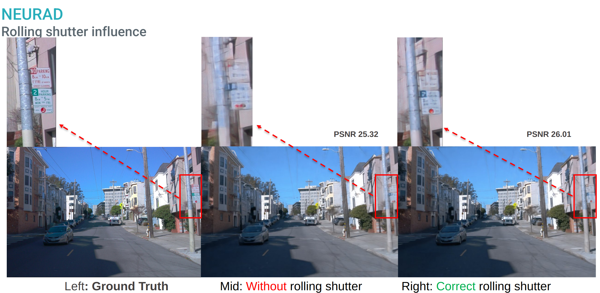
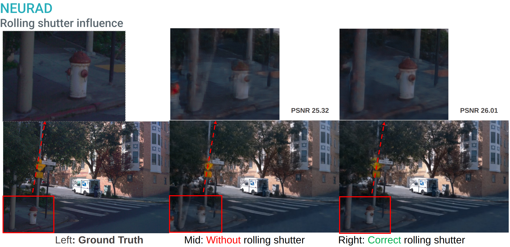
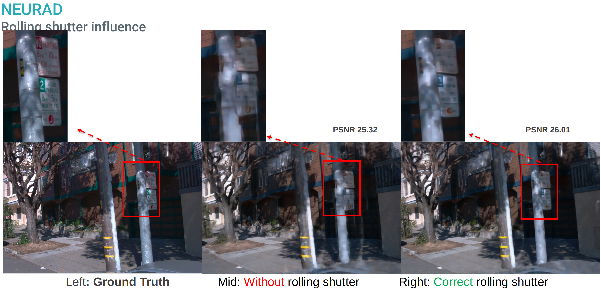

# NeuRAD on Waymo open dataset

## About
Thanks to the excellent work of NeuRAD, we reproduce some results on the Waymo open dataset.

Our goal in reproducing and open-sourcing this waymo dataparser for NeuRAD is to provide a basic reference for the self-driving community and to inspire more work.

In the same folder, there is [wod_dataparser.py](./wod_dataparser.py) which followed the [README-Adding Datasets](https://github.com/georghess/neurad-studio?tab=readme-ov-file#adding-datasets) suggestions. In addition, we added also [wod_utils.py](./wod_utils.py) which did the main work for converting/exporting Waymo dataset.

In addition, we have also added the rolling shutter support for Waymo dataset as the rolling shutter direction is horizontal instead of the vertical one in Pandaset. Here are some examples of the comparison results (on squence of 10588):

### Benchmark between Pandaset & Waymo
|  Dataset	| Sequence 	|  Frames | Cameras	|  PSNR	| SSIM 	| LIPS |
|---	    |---	    |---	  |---      |---	|---	|---   |
| Pandaset	| 006     	|80       | FC   	|25.1562​|0.8044​ |0.1575​|
| Pandaset 	| 011  	    |80   	  | 360  	|26.3919​|0.8057​ |0.2029​|
| Waymo  	| 10588771936253546636|  50	|   FC	| 27.5555|0.8547|0.121
| Waymo  	| 473735159277431842  | 150| FC 	| 29.1758|0.8717|0.1592
| Waymo  	| 4468278022208380281  | ALL| FC 	|30.5247​|0.8787​|0.1701​

Notes: All above results were obtained with the same hyperparameters and configurations from NeuRAD paper (**Appendix A**)

### Results
#### Waymo RGB rendering - Sequence 10588 - 3 cameras (FC_LEFT, FC, FC_RIGHT)

> Up is ground truth, bottom is rendered.

#### Actor removal - Sequence 20946​ - FC cameras

> Left is ground truth, right is rendered.

#### Novel view synthesis - Sequence 20946​ - Ego vehicle 1m up

> Left is ground truth, right is rendered.

#### Novel view synthesis - Sequence 20946​ - Ego vehicle 1m left

> Left is ground truth, right is rendered.

## Links

Results has been done with waymo open dataset [v2.0.0, gcloud link](https://console.cloud.google.com/storage/browser/waymo_open_dataset_v_2_0_0)

## Contributors

- Lei Lei, Leddartech
- Julien Stanguennec, Leddartech
- Pierre Merriaux, Leddartech